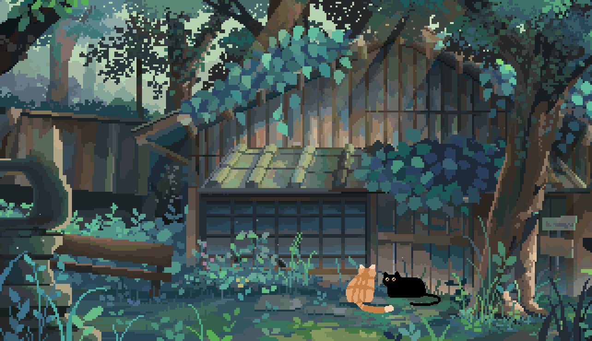
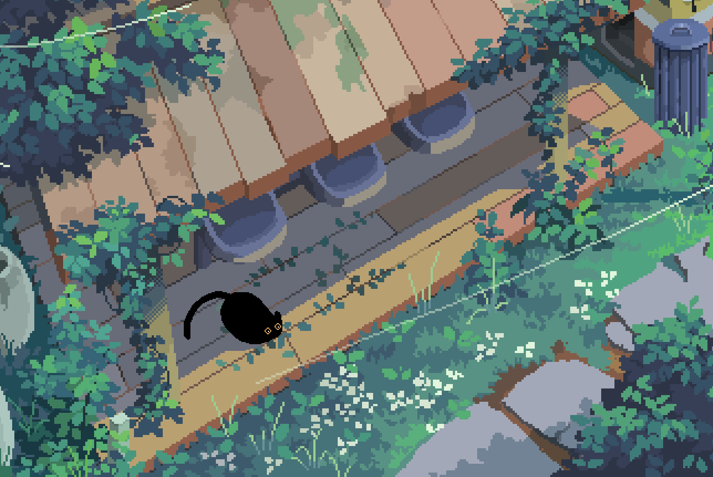
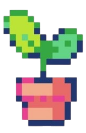

  

<!-- gif decorativo principal -->

<!-- redes sociais / links -->

  

<!-- seção: sobre mim -->

  <strong>Quem sou eu?</strong>

  

<!-- gif lateral decorativo -->
  

<!-- texto principal -->
  

    Sou estudante de Análise e Desenvolvimento de Sistemas na <em><b>FIAP </b></em> e eu gosto muito de me desafiar e transformar ideias em algo real. 

<!-- lista de informações pessoais -->
  

     <em><b> Estudante de Analise de Desenvolvimento de Sistemas na FIAP </b></em>  
     <em><b>Buscando evoluir em design, usabilidade e qualidade de código </b></em> 
     <em><b> Em busca de uma oportunidade de Estágio em TI </b></em> 
  

  
<!-- seção: tecnologias -->

  <strong>Tecnologias</strong>

  

<!-- badges das tecnologias -->
  

    
    
    
    
    
  

  

<!-- seção: estatísticas do github -->

  <strong>Estatísticas</strong>

  

<!-- gráfico de atividade -->
  

